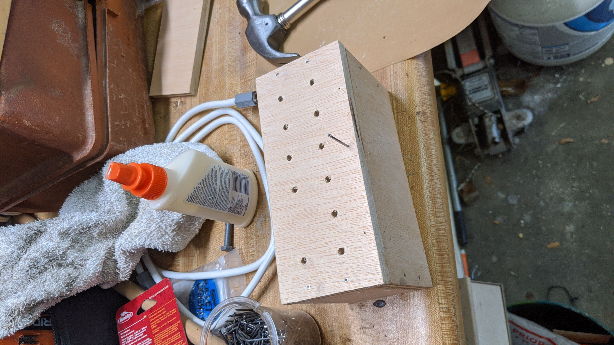
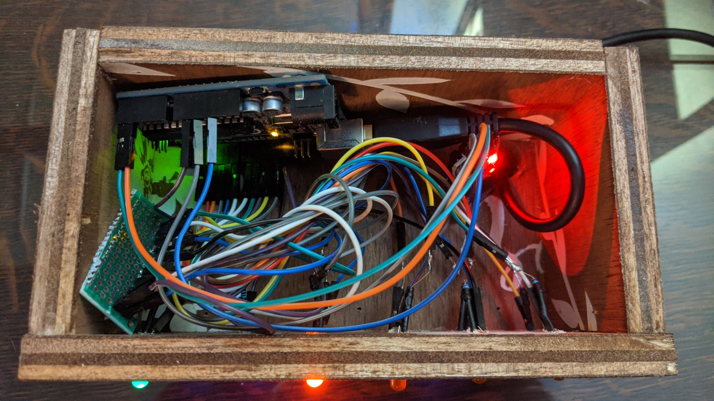

# Arduino-Binary-Clock

## Supplies
- Wood working supplies
- Solder iron
- 6 LEDs of some color (note, these will be the minutes of the clock)
- 4 LEDs of some other color (note, these will be the hours of the clock)
- 1 LED of some other other color (note, this will be the AM/PM signal of the clock)
- Arduino uno 
- RTC component DS3231
- Wire

## Process
1) Download source code
2) Boot source code onto arduino
3) Follow the below circuit diagram (TBD)
4) Create a box to hold the clock (I used wood for this, but could use cardboard, foam, etc), drill/cut holes to fit the LEDs in whatever form you want/what makes sense to you
5) Install your circuit into your box and voila 

